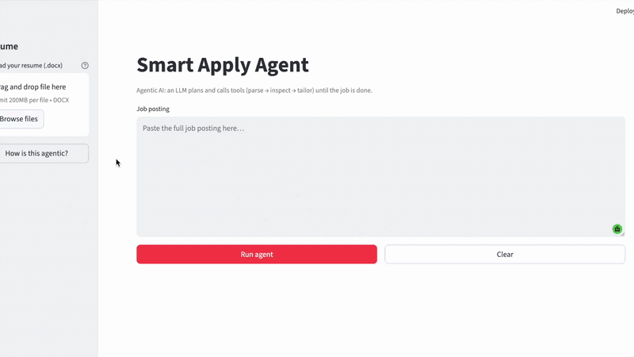

# Smart Apply Agent 🤖

An agentic AI app that tailors your resume to any job posting automatically.

Paste a job posting, upload your resume, and let the LLM plan and execute a multi-step pipeline to deliver a tailored `.docx` ready to submit.

## Demo


## How It Works

Unlike a fixed script, the **LLM chooses tools** in a loop until the job is done:

```
parse_job_posting → inspect_resume → tailor_resume → finish
```

1. **parse_job_posting**: extracts company name, job title, and requirements from raw text
2. **inspect_resume**: reads and understands the current resume content
3. **tailor_resume**: rewrites bullet points to match the job, preserving original formatting
4. **finish**: returns the tailored `.docx` for download

Each step is visible in the UI so you can follow the agent's reasoning in real time.

## Features

- Paste any job posting as raw text and AI parses it automatically
- Upload your resume as `.docx` and original formatting is preserved
- Tailored resume downloads instantly as `.docx`
- Fully agentic: LLM decides what to do next at each step

## Tech Stack

- **Python**: core language
- **OpenAI API**: LLM + function calling for agentic tool use
- **Streamlit**: UI
- **python-docx**: resume parsing and formatting-preserving output

## Setup

**1. Clone and install**
```bash
git clone https://github.com/aliciaparkkk/smart-apply-agent.git
cd smart-apply-agent
python -m venv .venv
source .venv/bin/activate
pip install -r requirements.txt
```

**2. Set environment variables**
```bash
cp .env.example .env
```
Add your OpenAI API key to `.env`:
```
OPENAI_API_KEY=sk-...
```

**3. Run**
```bash
streamlit run app.py
```

## Usage

1. Upload your resume (`.docx`)
2. Paste a job posting
3. Click **Run agent**
4. Download your tailored resume

## Project Structure

```
smart-apply-agent/
├── app.py                 # Streamlit UI
├── smart_apply/
│   ├── agent/             # Agent loop + tool definitions
│   ├── job_parser.py      # Job posting parser
│   ├── resume_tailor.py   # Resume tailoring logic
│   └── resume_io.py       # Resume read/write with formatting
├── requirements.txt
└── .env.example
```

## Why It's Agentic

Most AI tools generate text in a single call. This app implements a **ReAct-style agent loop**, the LLM:
- Receives the task and available tools
- Decides which tool to call and why
- Observes the result
- Repeats until it decides the task is complete

This means the agent can adapt its plan mid-execution, not just follow a fixed script.

---

Built by [Alicia Park](https://aliciaparkkk.github.io/aliciapark_website/) as part of an Agentic AI Engineer interview project.